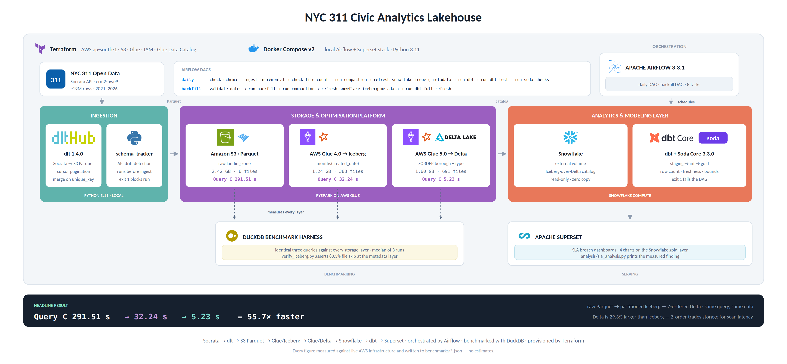

# 🏙️ NYC 311 Civic Analytics Lakehouse


---

## 📌 Project Overview

This project is a **production-grade lakehouse** built on real NYC 311 service request data (**19,095,833 rows, 2021–2026**), designed to answer one question with measured evidence: **does storage format evolution actually make queries faster, and by how much?**

The same dataset is materialised three times — raw Parquet, partitioned Apache Iceberg, and Z-ordered Delta Lake — and the *same three queries* are benchmarked against each layer. The result is a **55.7× speedup** on the most selective query, with every intermediate number recorded to JSON rather than estimated.

On top of that storage layer sits a civic analytical output: **which NYC agencies are systematically breaching their published service level targets, and is it getting worse?**

👉 Think of it as a **lakehouse optimisation study** with a real analytical payload attached — not a tool demo.

---

## 🏗️ Architecture



**Pipeline Flow:**

1. **dlt** → cursor-paginated ingestion from the NYC Open Data Socrata API (`erm2-nwe9`) into S3 as Hive-partitioned Parquet.
2. **Schema tracker** → compares the live API schema against the saved snapshot; exits non-zero on breaking changes before any data is written.
3. **AWS Glue 4.0** → converts raw Parquet to **Apache Iceberg** with hidden partitioning (`months(created_date)`, `truncate(borough,1)`).
4. **AWS Glue 5.0** → converts Iceberg to **Delta Lake**, then runs `OPTIMIZE ... ZORDER BY (borough, complaint_type)` and `VACUUM`.
5. **Snowflake** → reads the Delta table in place via an **external volume + Iceberg-over-Delta catalog integration** — read-only, zero data copy.
6. **dbt** → staging → intermediate (ephemeral) → gold models producing the SLA breach analysis.
7. **Soda Core** → quality gates on row counts, freshness, and value bounds.
8. **Airflow 3.3.1** → orchestrates the daily pipeline and a separate manual backfill DAG.
9. **Apache Superset** → dashboards over the Snowflake gold layer.

---

## ⚡ Tech Stack

- **dlt 1.4.0** → Socrata API ingestion with cursor-based pagination on `created_date` + `unique_key`
- **Terraform** → S3 bucket, Glue database, IAM role, lifecycle rules
- **AWS S3 (`ap-south-1`)** → Storage for raw, silver, gold, and benchmark prefixes
- **AWS Glue 4.0** → PySpark job for the Iceberg conversion
- **AWS Glue 5.0** → PySpark job for the Delta conversion and Z-order compaction
- **Apache Iceberg (PyIceberg)** → Hidden partitioning + metadata-level file pruning
- **Delta Lake (delta-rs)** → Z-ordered layout, time travel, `OPTIMIZE`/`VACUUM`
- **DuckDB** → Local benchmark execution engine across all three storage layers
- **Snowflake** → External volume + catalog integration over Delta, no data copy
- **dbt (Snowflake adapter)** → Staging, intermediate, and gold transformation layer
- **Soda Core 3.3.0** → Declarative data quality checks with pipeline-failing exit codes
- **Apache Airflow 3.3.1** → Daily DAG + backfill DAG, Docker Compose deployment
- **Apache Superset** → SLA breach dashboards over the gold layer
- **Docker Compose v2** → Local Airflow and Superset stack

---

## ✅ Key Features

- **Three-layer storage benchmark** — identical queries measured against raw Parquet, Iceberg, and Z-ordered Delta, with file counts and skip rates recorded at each layer
- **Metadata-level partition pruning proven, not claimed** — `verify_iceberg.py` asserts an **80.3% file skip rate** on a single-borough filter *before any data file is opened*
- **Z-ordering measured honestly** — the 55.7× headline holds only for queries filtering on the Z-order columns; Query A is roughly flat and Query B is **50% slower** on Delta than Iceberg, reported as-is rather than smoothed over
- **Zero-copy Snowflake integration** — Delta tables queried in place via external volume, no `COPY INTO`, no duplicated storage
- **Schema drift detection** — the tracker runs first in every DAG execution and blocks ingestion on breaking Socrata schema changes
- **Anomaly flagging over filtering** — negative and 700+ day resolution times are real 311 patterns; they are flagged with a reason, not silently dropped
- **Quality gates with teeth** — Soda Core exits code 1, failing the Airflow task and the DAG run
- **Findings that contradict expectations** — the pre-scripted "HEAT/HOT WATER is worsening" hypothesis was **wrong against real data**, and the README says so

---

## 📊 Benchmark Results

All numbers are **measured** against live AWS infrastructure and written to `benchmarks/*.json`. Query definitions are identical across all three layers.

| Query | Access pattern |
|---|---|
| **A** | Full-history aggregation, no filters — worst case, scans everything |
| **B** | Date-filtered time series — benefits from date partitioning |
| **C** | `borough` + `complaint_type` + date range — the most selective query |

**Query latency (median of 3 runs):**

| Query | Raw Parquet | Iceberg | Delta + Z-order | Total speedup | Delta vs. Iceberg |
|---|---|---|---|---|---|
| A (full aggregation) | 95.13 s | 68.91 s | 71.35 s | 1.33× | −3.5% |
| B (date filter) | 142.68 s | 22.53 s | 33.85 s | 4.22× | **−50.2%** |
| **C (most selective)** | **291.51 s** | **32.24 s** | **5.23 s** | **55.7×** | +516% |

Row count across all three layers: **19,095,833** requests (2021–2026, benchmarked as a full scan).

**Storage and file layout:**

| Layer | Size | Files | vs. previous |
|---|---|---|---|
| Raw Parquet (Stage 1) | 2.42 GB | 6 | — |
| Iceberg partitioned (Stage 2) | 1.24 GB | 383 | −48.8% |
| Delta + Z-order (Stage 3) | 1.60 GB | 691 | **+29.3%** |

**Partition pruning** (`verify_iceberg.py`, single-borough filter): **80.3% of files skipped at the metadata layer**, before any data read. On Query C specifically, only **12 of 383 files** are opened — 96.9% skipped — measured via `plan_files()`, so the skipping is proven at the metadata layer rather than by reading and discarding data.

### Results that did not go the way the guide predicted

Reported as measured, because the interesting engineering is in the explanation:

- **Delta is 29.3% larger than Iceberg**, not smaller. Z-ordering rewrites data into more, smaller files to achieve clustering; the layout that makes Query C fast costs storage. The trade is deliberate and measured.
- **Query A is roughly flat (−3.5%) and Query B is 50.2% slower on Delta than on Iceberg** (22.53 s → 33.85 s). Neither filters on `borough` or `complaint_type`, so neither benefits from the Z-order. The likely explanation is that Z-ordering rewrote the data into more files (383 → 691) with no compensating benefit for a date-only filter — but that's a hypothesis, not yet isolated by a follow-up test. Z-ordering is not a free global speedup, and this project reports the regression rather than smoothing over it. See `future_work.md`.
- **dbt incremental scanned 22.1% *more* bytes than a full refresh**, the opposite of the expected reduction. Two causes: Snowflake cannot push filter pruning through the Iceberg-over-Delta catalog layer, so the incremental `WHERE` clause does not prune files; and the gold models fully rebuild regardless of staging incrementality. Incremental strategy is only as good as the pruning the catalog can support.
- **Delta UniForm was formally deferred** (see `DECISIONS.md`). Glue Data Catalog's Hive-compatibility layer cannot satisfy UniForm's Thrift metastore requirement, and standing up a minimal HMS would cost ~$25–45/month for a feature no benchmark in this project depends on.

---

## 🔎 The Finding

**Headline: HPD Elevator complaints breach their 1-day SLA target 80–93% of the time, every year measured.**

| Complaint type | Agency | Target | Breach rate (2021–2025) | Trend |
|---|---|---|---|---|
| ELEVATOR | HPD | 1 day | ~80% → ~93% | Worsening |
| HEAT/HOT WATER | HPD | 7 days | 1.28% → 0.43% | **Improving** |

Two things are worth stating plainly:

1. **The initially expected finding didn't hold.** An early hypothesis was that HEAT/HOT WATER breach rates were worsening — but against real 2021–2025 data, HEAT/HOT WATER is one of HPD's **best-performing** categories and is *improving*. The assumption did not survive contact with the data.

2. **The real story is the Elevator SLA.** A 1-day target against a complaint type that structurally cannot be resolved in a day produces a near-total breach rate. This is less "an agency is failing" than "a target is miscalibrated" — and that distinction is only visible because the gold layer joins measured resolution times against published targets.

**Scope note:** 2026 is excluded from all trend calculations as a partial year. The clean trend window is **2021–2025**.

An earlier iteration reported 95–97% Elevator breach rates. That figure was wrong — caused by a complaint-type normalisation bug where the seed file referenced `BROKEN MUNI METER`, a value that does not exist in the Socrata taxonomy (the correct value is `Broken Parking Meter`). The corrected figure is 80–93%.

---

## 📈 Dashboard


Built in **Apache Superset** over the Snowflake gold layer (`gold.fct_sla_performance`, `gold.fct_sla_trends`):

| Chart | Type | What it shows |
|---|---|---|
| SLA breach rate by agency over time | Line | Which agencies are trending worse year over year |
| Top 10 complaint types by breach rate | Bar | The Elevator finding, ranked against all other categories |
| Borough comparison — HEAT/HOT WATER | Table | Whether the improvement is city-wide or borough-specific |
| Year-over-year trend | Table | `breach_rate_y_minus_4` → `breach_rate_current` with direction flag |

Superset connects to Snowflake, which reads Delta in place — so the dashboard is served from the same physical Parquet files the benchmarks measured. No separate serving copy. Screenshot above is from the live local instance (`docker compose up -d`, `localhost:8088`), not a mockup.

---

## 📂 Repository Structure

```
NYC_311_Lakehouse/
├── terraform/                # S3 bucket, Glue database, IAM role
│   └── main.tf
├── ingestion/                # dlt pipeline + schema drift detection
│   ├── dlt_311_pipeline.py
│   └── schema_tracker.py
├── glue_jobs/                # PySpark conversion + compaction jobs
│   ├── raw_to_iceberg.py     # Glue 4.0
│   ├── iceberg_to_delta.py   # Glue 5.0
│   └── compaction.py         # OPTIMIZE ZORDER + VACUUM
├── iceberg/
│   └── verify_iceberg.py     # asserts partition pruning file-skip rate
├── delta/
│   └── verify_delta.py       # row-count and version parity checks
├── benchmarks/               # per-stage query benchmarks → JSON
│   ├── baseline_queries.py
│   ├── iceberg_queries.py
│   ├── delta_queries.py
│   ├── storage_report.py
│   ├── compare_stages.py
│   └── dbt_performance.py
├── dbt/                      # staging → intermediate → gold
│   ├── models/{staging,intermediate,gold}/
│   ├── seeds/sla_targets.csv
│   └── dbt_project.yml
├── soda/                     # data quality gates
│   ├── checks_311.yml
│   └── run_checks.py
├── airflow/dags/             # daily pipeline + manual backfill
│   ├── nyc_311_daily.py
│   └── nyc_311_backfill.py
├── superset/
│   └── superset_config.py
├── analysis/
│   └── sla_analysis.py       # formatted output of the finding
├── docs/
├── docker-compose.yml
├── requirements.txt
├── .env.example
├── DECISIONS.md              # architecture decision records
└── future_work.md            # scoped next steps
```

---

## ⚙️ Step-by-Step Implementation

### Stage 1 — Raw Ingestion & Baseline
Terraform provisions the S3 bucket (`nyc-311-lakehouse`, `ap-south-1`), Glue database, and IAM role. A dlt pipeline pulls 2021–2026 from the Socrata API using cursor-based pagination on `created_date` + `unique_key`, writing Hive-partitioned Parquet. Three benchmark queries establish the "before" numbers against 6 unpartitioned files.

### Stage 2 — Apache Iceberg
A Glue 4.0 PySpark job converts raw Parquet to Iceberg with hidden partitioning: `months(created_date)` (≈60 partitions with meaningful row counts, rather than 1,800 near-empty daily ones) and `truncate(borough,1)` (NYC boroughs all start with distinct letters, so a `borough = 'BROOKLYN'` filter prunes the rest automatically). `verify_iceberg.py` proves pruning happens at the metadata layer.

### Stage 3 — Delta Lake & Z-order
A Glue 5.0 job converts Iceberg to Delta, then `compaction.py` runs `OPTIMIZE ... ZORDER BY (borough, complaint_type)` followed by `VACUUM`. Z-ordering is *additive* to partition pruning: pruning eliminates files, Z-ordering reduces bytes read within the files that do get opened. Storage is measured after `VACUUM`, never before.

### Stage 4 — dbt & Snowflake
Snowflake reads Delta in place via an external volume and Iceberg-over-Delta catalog integration — read-only, no copy. dbt builds `stg_311_requests` (incremental merge, `on_schema_change='fail'`), an ephemeral `int_requests_enriched` joining to the SLA targets seed, and gold fact tables. Anomalous resolution times are flagged with a reason, not filtered. Soda Core gates the output.

### Stage 5 — Orchestration & Dashboards
**Airflow 3.3.1** orchestrates both DAGs end to end (chosen for deep existing familiarity and far stronger representation in job postings — see `DECISIONS.md`):

```
daily:     check_schema → ingest_incremental → check_file_count → run_compaction
           → refresh_snowflake_iceberg_metadata → run_dbt → run_dbt_test → run_soda_checks

backfill:  validate_dates → run_backfill → run_compaction
           → refresh_snowflake_iceberg_metadata → run_dbt_full_refresh
```

Superset dashboards sit on top of the Snowflake gold layer.

---

## 🚀 Getting Started

### Prerequisites
- **AWS account** with credentials configured (`aws configure`)
- **Terraform** ≥ 1.5
- **Python 3.11** (dlt is not compatible with 3.13 — see `DECISIONS.md`)
- **Docker Engine** with the **Compose v2** plugin
- **Snowflake account** (trial is sufficient)
- **NYC Open Data app token** — free, from `data.cityofnewyork.us`

### Setup

```bash
git clone https://github.com/darkxaze/NYC_311_Lakehouse.git
cd NYC_311_Lakehouse

cp .env.example .env          # fill in AWS, Snowflake, and Socrata credentials
pip install -r requirements.txt
```

**1. Provision infrastructure**

```bash
cd terraform && terraform init && terraform apply && cd ..
```

**2. Ingest raw data** (~19M rows; several hours on first full load)

```bash
python ingestion/schema_tracker.py            # saves initial schema snapshot
python ingestion/dlt_311_pipeline.py --full-load
```

**3. Build the storage layers**

```bash
aws s3 cp glue_jobs/ s3://nyc-311-lakehouse/glue_jobs/ --recursive

aws glue start-job-run --job-name raw_to_iceberg      # Glue 4.0
aws glue start-job-run --job-name iceberg_to_delta    # Glue 5.0
aws glue start-job-run --job-name compaction          # OPTIMIZE + VACUUM
```

**4. Connect Snowflake and run dbt**

Run `docs/snowflake_setup.sql` to create the external volume and catalog integration, then:

```bash
export $(cat .env | xargs)
cd dbt && dbt deps && dbt seed && dbt run && dbt test && cd ..
python soda/run_checks.py
```

**5. Start Airflow and Superset**

```bash
docker compose up -d
docker compose ps
```

| Service | URL |
|---|---|
| Airflow | http://localhost:8080 |
| Superset | http://localhost:8088 |

Superset dashboard setup is manual: add the Snowflake connection, register `gold.fct_sla_performance` and `gold.fct_sla_trends` as datasets, then build the four charts listed above.

---

## 🧪 Usage

```bash
# Ingestion
python ingestion/schema_tracker.py                       # schema drift check
python ingestion/dlt_311_pipeline.py --incremental       # daily delta load

# Verification
python iceberg/verify_iceberg.py                         # asserts >50% file skip
python delta/verify_delta.py                             # row-count parity

# Benchmarks
python benchmarks/baseline_queries.py                    # raw Parquet
python benchmarks/iceberg_queries.py                     # Iceberg
python benchmarks/delta_queries.py                       # Delta + Z-order
python benchmarks/storage_report.py                      # GB per layer (post-VACUUM)
python benchmarks/compare_stages.py                      # side-by-side summary
python benchmarks/dbt_performance.py                     # incremental vs full refresh

# Analytical output
python analysis/sla_analysis.py                          # prints the finding

# Transformations & quality
cd dbt && dbt run && dbt test && cd ..
python soda/run_checks.py
```

---

## 📐 Engineering Decisions

Every non-obvious choice is recorded as an ADR in [`DECISIONS.md`](DECISIONS.md), with context, options considered, rationale, and consequences. Highlights:

- **`months(created_date)` over `days(created_date)`** — daily partitioning across the date range produces ~1,800 partitions with too few rows each to be useful; monthly gives meaningful row counts per partition.
- **Z-order on `borough` and `complaint_type`** — the two most common analytical filter columns. The 55.7× Query C speedup and the flat Query A/B results are both direct consequences of that choice.
- **Airflow 3.3.1 for orchestration** — deep existing familiarity, and far stronger representation in job postings than the alternatives considered.
- **Snowflake external volume over `COPY INTO`** — zero data duplication, single source of truth. The cost: Snowflake cannot push filter pruning through the catalog layer, which is exactly why the dbt incremental benchmark came back negative.
- **UniForm deferred** — Glue Data Catalog cannot satisfy UniForm's Thrift metastore requirement; a minimal HMS was not worth ~$25–45/month for a feature no benchmark depends on.
- **`LEFT JOIN` on the coordinates child table** — some 311 records legitimately have no coordinates. An inner join would silently drop them.
- **Anomaly flagging over filtering** — negative and 700+ day resolution times are retroactively merged and abandoned cases respectively. Filtering them would undercount breaches; flagging lets downstream models decide.

---

## 🔮 Future Work

Deliberately scoped to the lakehouse and analytics layers. The natural extension is an ML layer — 311 demand forecasting and agency resource allocation — built on features the gold models already produce. Concrete next steps are in [`future_work.md`](future_work.md).

---